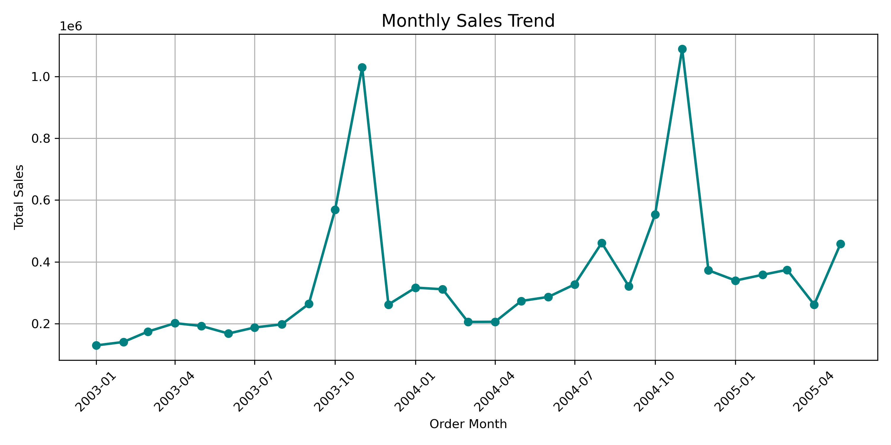

Mini Data Analysis project using PostgreSQL, Python (Pandas), and Matplotlib to explore sales trends.

# 🛍️ Sales Data Analysis Project

This mini-project analyzes a retail sales dataset using Python and Pandas to uncover sales trends and product performance.

## 📂 Overview
- Cleaned the dataset (handled missing values and data types)
- Performed exploratory analysis using `groupby`, aggregation, and sorting
- Created a monthly sales trend chart with `Matplotlib`

## 📊 Key Insights
- **Classic Cars** was the highest performing product line in total sales.
- Sales peaked in certain months, revealing seasonal trends.
- Used both PostgreSQL and Python for data prep and analysis.

## 📎 Included Files
- `Sales Data.ipynb`: Cleaned & annotated notebook
- `monthly_sales.png`: A bar chart visualizing monthly sales
- `sales_data.csv`: Raw dataset used

## 📈 Sample Chart

---

## 🔧 Tech Used
- Python, Pandas, Matplotlib
- Jupyter Notebook
- PostgreSQL (for initial data cleaning)

---

## 🤝 Connect With Me
www.linkedin.com/in/tatianabrimm1026 
